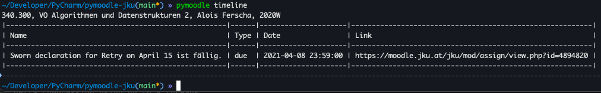

# PyMoodle-JKU Linz

A local python client for accessing the jku moodle page. Passwords aren't sent anywhere except to the official moodle
page https://moodle.jku.at/jku/login/index.php! Optionally you can store them in the local system keyring.

It's also a python library, which you can use in your project.

##### Table of Contents

[Description](#Description)  
[Install](#Install)  
[Terminal Application](#Commandline-Scripts)  
[Python Package](#Python-Package)  
[Dependencies and Unittests](#Good-To-Know)  
[Unsupported](#Unsupported)  
[Contribution](#Contribution)  
[Planned](#Planned)

## Description

What can you do with PyMoodle? A Short Overview.

You can do all this from the commandline and much more:

- Download files from moodle videos/pdf/folder/etc. and even **Exams** as markdown
- List all your grades without needing to open the browser and search moodle
- List your timetable from moodle.
- Password of moodle can be stored in the local system keyring. No need to enter it every time!

## Install

`pip3 install -U pymoodle-jku `

To Download streams, you need [ffmpeg](https://ffmpeg.org/download.html) installed. Can also be done after installing
pymoodle.

To get autocompletion working add this to your bash .bashrc/.zshrc/....:

`eval "$(register-python-argcomplete pymoodle)"`

If you are using fish/Tcsh or another shell, have a closer
look [here](https://github.com/kislyuk/argcomplete#zsh-support).

## Commandline Scripts

The commandline script is called **pymoodle**.

With **pymoodle** you can call these Utilities:

- download
- grades
- timeline
- config

**Just call `pymoodle` from the terminal to get the Help page.**

You will also find everything you need if you call:
`pymoodle --help` or `pymoodle {Utility} --help`

Credentials won't be stored anywhere. If the username/password is entered while running Utilities (not with `-c`), you
will be asked if you want to store your password in the keyring. The Keyring is a local Password Storage where all
passwords are securely stored.

### Config

With the config utility you can configure your environment. You can either specify arguments that should be changed (
see `pymoodle config --help`) or launch the config in interactive mode like this: `pymoodle config`

Its **recommended** to configure your environment once if you want. You can also set a default download Path. (which
needs to exist before downloading.)

### Download

With the download utility you can download files and exams from moodle. There are multiple ways to select a course. If
you run the `pymoodle download` without any arguments, you can pick the downloadable courses. But you can also Download
everything from the current semester like this: `pymoodle download -a`
To download really everything call `pymoodle download -a -o`. This will also download all older semesters.

Or it's possible to search and download courses, which name includes the word "Logic" or "Daten" like
this: `pymoodle download -s Logic -s Daten`

To download stuff from old courses specify the `-o` option, else only running/current courses will be considered. In
interactive mode you can press *M* or *m* to load old/more courses.

**Only for people who used PyMoodle before**

It seems like, Pymoodle had some problems. Thus a lot of not downloaded urls got written to 'urls.txt'. Just delete the
file if you want to try a redownload. Or if you only want to redownload the exams/quizes call:
`pymoodle download -e -o`

### Grades

Grades will launch automatically in interactive mode. It can give you a short overview about your grades, or you can
look at the specific evaluations from a course. Just like {download} it's also possible to use `-o` for old courses
or `-s` to search for courses.

### Timeline

Timeline shows your next few moodle events from the moodle calendar. The only argument you could specify is the max
limit of events to show (`--limits 15`).

## Python Package

There are multiple examples how to use the PyMoodle package. Just look in the [examples](./examples) folder and start
with [moodle_client.py](./examples/moodle_client.py).

There are examples for:

- Login
- Courses (Data/Section/Urls from a course)
- Valuation of a course.
- Moodle Calendar
- Downloads

## Good To Know

### Unittests

I have set up multiple [unittests](./tests), to ensure that the next releases won't introduce bugs.

### Dependencies

- argcomplete: Is for commandline auto completion.
- cryptography: To encrypt cookies/session key with the users password.
- html2markdown: Converts HTML from Moodle to Markdown
- [keyring](https://pypi.org/project/keyring/): Saves your password secure locally. (on windows called Credential
  Locker)
- io-uuid: One of my own packages. Is for creating unique filenames.
- lxml: Is to parse HTML.
- pick: A simple Terminal Picker.
- pytube: For downloads from youtube.
- sty: Colors for the terminal. Still needs to be implemented.
- urllib3: for parsing urls and so stuff.
- requests: for sending requests
- requests-futures: A Wrapper around future to send asynchrones requests.

## Unsupported

- Downloading of Zoom streams of jku.zoom.us isn't supported for now. If somebody get it working please feel free to do
  a merge request.

## Contribution

If you want to add something, create an issue and do a pull request.

### Install for testing

* clones this repo
* `pip3 install -r requirements.txt`

## Planned

- [ ] Log file support
- [ ] file uploader for assignments

Something that also seems interesting would be a kusss integration:

- [ ] a kusss integration for checking grades
- [ ] a kusss integration for registering in courses (so you don't have struggles when the kusss webserver is dying)

I don't really know if I want to integrate or should integrate that, if a few people are interested in that I am more
willing to spend time on it.
